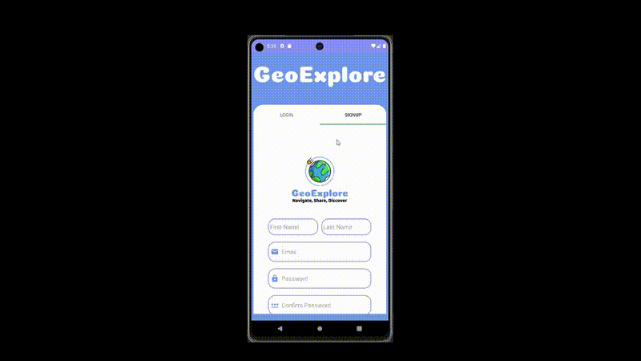

# GeoExplore

Welcome to GeoExplore! The Android app designed to keep local communities connected and aware by enabling users to share and explore reports, events, and observations on an interactive map.

## Features

- **Interactive Map**: View and interact with markers for reports, events, and observations.
- **Proximity Search**: Display markers within a specified range or screen bounds.
- **Real-Time Updates**: Receive live updates on alerts and user locations via WebSocket connections.
- **CRUD Operations**: Create, update, delete, and view reports, events, and observations.
- **Image Uploads**: Attach images to observations and reports.
- **Comment System**: Add, edit, and delete comments on posts.
- **User Management**: Manage user groups and reported users.
- **Emergency Notifications**: Display emergency alerts on the map.
- **Distance Calculation**: View distances to markers from the user's current location.

## Demo

Check out the demo video to see GeoExplore in action:

## About the Project

GeoExplore was developed as part of **COM S 309: Software Development Practices** at Iowa State University. It showcases the application of software engineering principles in a real-world project.
